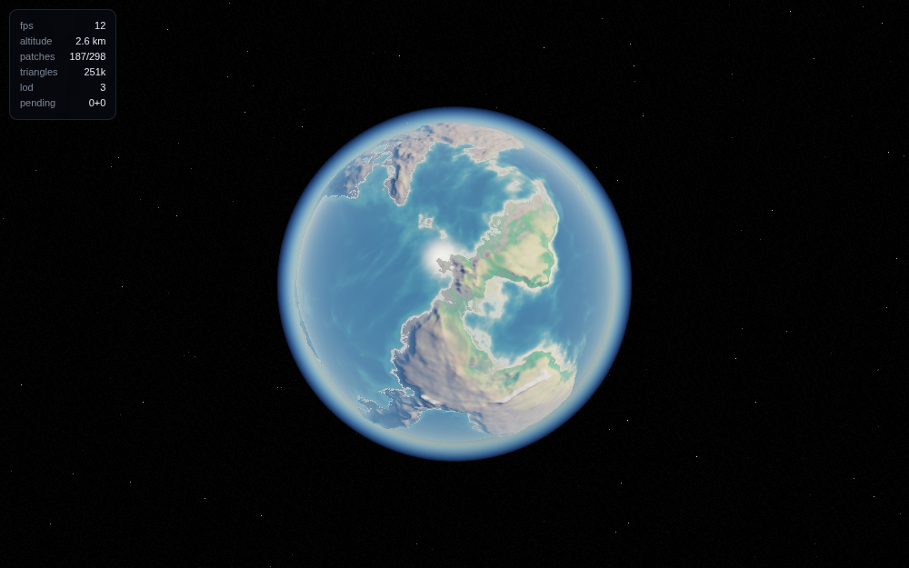
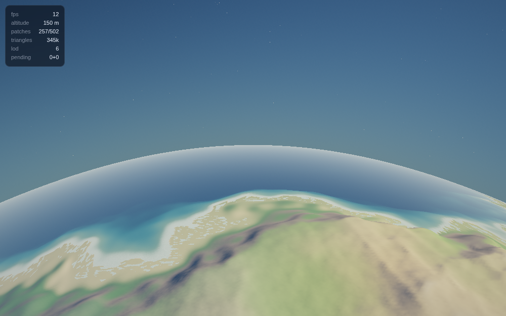
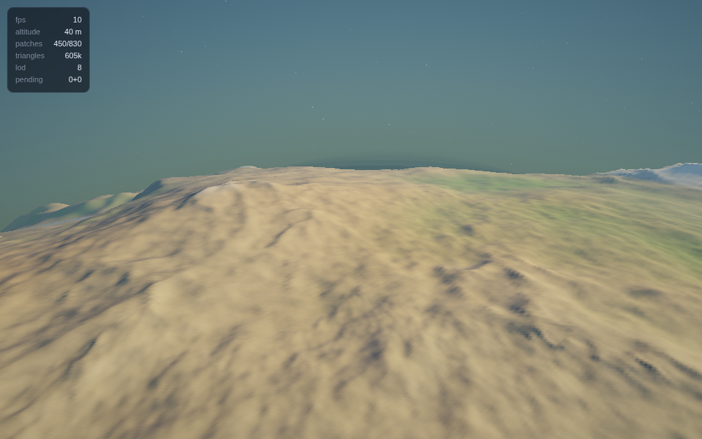
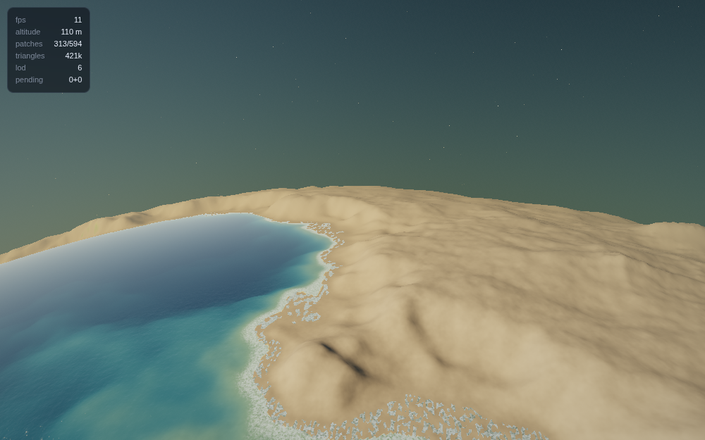
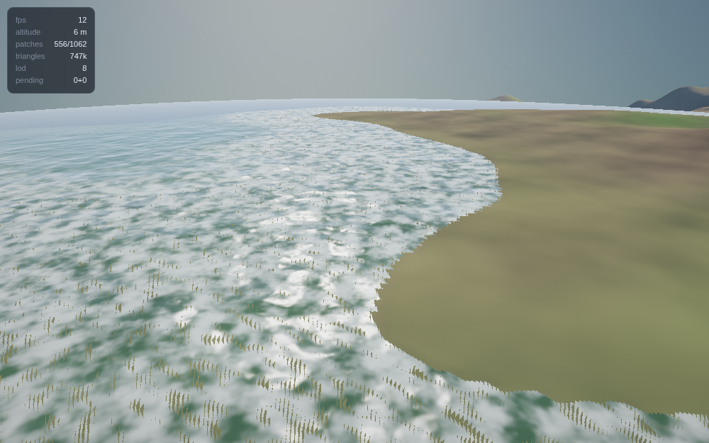

# Pocket Planet

A persistent civilization simulation on a living planet. Rotate a world, nudge a
civilization's priorities, and come back later to read the history it wrote while you
were gone.

> *143 years have passed. The Northern Empire collapsed after a prolonged famine.
> Three successor kingdoms have formed.*



## What it is

Somewhere between a god game, a virtual pet, and an idle simulation. You don't command
units — you set broad priorities (trade, war, education, expansion, conservation, culture)
and watch a civilization rise, spread, stagnate, fracture, and sometimes fall. Collapse
isn't game over: empires split into successor states, cultures and religions outlive the
polities that founded them, and ruins get resettled centuries later.

## Running it

```bash
npm install
npm run dev        # then open the printed LAN address on your phone
npm run build      # type-check and bundle to dist/
npm run shot       # render the reference screenshots headlessly
```

Deploys to Vercel as-is: Vite preset, `npm run build`, output `dist`.

### URL parameters

| Parameter | Effect |
|---|---|
| `seed=name` | World seed |
| `quality=low\|medium\|high` | Override the auto-detected quality tier |
| `hud=1` | Show the performance HUD (or press `H`) |
| `lat` `lon` `altitude` `heading` `sun` | Jump to a viewpoint, in degrees and metres |
| `scale=0.75` | Internal render resolution multiplier |

## What's built

The planet is finished; the civilization on it is next.

- **Continuous terrain, orbit to ground.** No hexes, no tiles, no visible cells anywhere.
  Terrain is a pure noise function of position on the sphere, evaluated at whatever detail
  the camera asks for, band-limited per LOD level so nothing boils as it subdivides.
- **Cube-sphere chunked LOD**, subdivided by screen-space error in pixels, meshed in a
  worker pool, with an adaptive governor that holds the triangle count steady.
- **An analytically ray-traced ocean.** The sea is not geometry — it's a sphere
  intersected per pixel in a screen-space pass, so the waterline is exact at every zoom
  and depth comes from the depth buffer.
- **Physically-based atmospheric scattering**, with aerial perspective, a glowing limb,
  and golden hour on the ground.
- **A visual regression harness** that drives the camera to fixed viewpoints and captures
  them headlessly.

| | |
|---|---|
|  |  |
|  |  |

## Stack

Web first — three.js and WebGL2, TypeScript, Vite, deployed to Vercel and playable on a
phone from a URL. Capacitor wraps the same build into an Android app once the game is
worth installing.

The simulation is a pure, deterministic, dependency-free TypeScript package with no DOM
and no three.js, so it runs identically in the browser worker and in Node for the headless
balance tools. Seed plus player-event log reproduces any history exactly.

## Where the interesting problems are

See [`docs/PLAN.md`](docs/PLAN.md) for the full plan. The parts worth reading:

- **Why the atmosphere's scale height follows the camera.** How far you can see before the
  air whites out and how blue the sky is overhead are not independent — their ratio is
  `distance / scaleHeight`. On a planet with a one-kilometre radius, no fixed value works
  for both the ground and orbit, so the scale height varies while `beta × H` is held
  constant to pin the sky.
- **Why there are no citizen agents.** Population is a scalar; the people you see are
  renderer decoration. That is what makes 143 years of offline progress resolvable in
  milliseconds.
- **Why the balance harness is scheduled before the fun parts.** The hard problem in this
  genre is not rendering; it's economies drifting into degenerate equilibria over long
  horizons.
