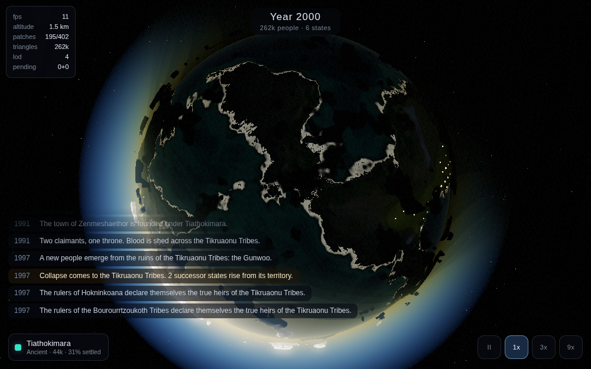
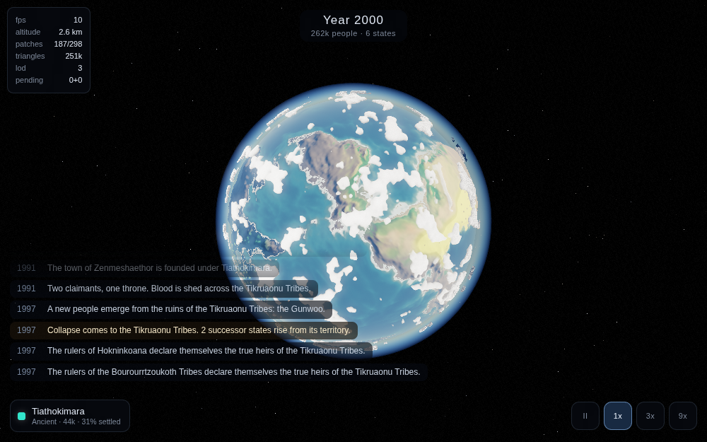
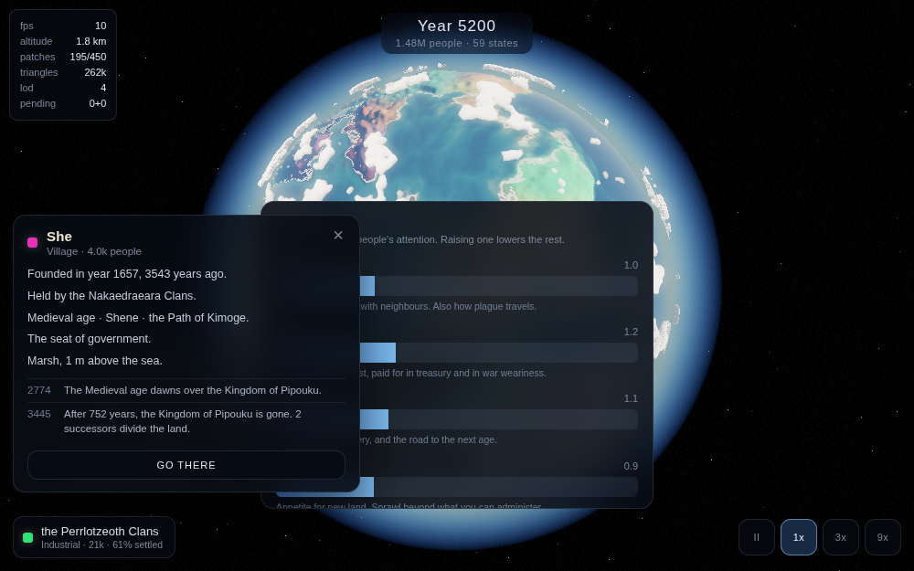

# Pocket Planet

A persistent civilization simulation on a living planet. Rotate a world, nudge a
civilization's priorities, and come back later to read the history it wrote while you
were gone.

> *143 years have passed. The Northern Empire collapsed after a prolonged famine.
> Three successor kingdoms have formed.*


## What it is

Somewhere between a god game, a virtual pet, and an idle simulation. You don't command
units — you set broad priorities (trade, war, education, expansion, conservation, culture)
and watch a civilization rise, spread, stagnate, fracture, and sometimes fall. Collapse
isn't game over: empires split into successor states, cultures and religions outlive the
polities that founded them, and ruins get resettled centuries later.

## Running it

```bash
npm install
npm run dev        # then open the printed LAN address on your phone
npm run build      # type-check and bundle to dist/

npm run soak         # 120 worlds x 3000 years, headless, with assertions
npm run history      # print one world's chronicle as the player would read it
npm run verify-save  # prove a reloaded world is the same world
npm run verify-motion # prove the sea still moves
npm run verify-camera # prove the planet follows your finger
npm run shot         # render the reference screenshots headlessly
npm run probe        # check the terrain function's statistics
```

Deploys to Vercel as-is: Vite preset, `npm run build`, output `dist`.

### URL parameters

| Parameter | Effect |
|---|---|
| `seed=name` | World seed |
| `quality=low\|medium\|high` | Override the auto-detected quality tier |
| `hud=1` | Show the performance HUD (or press `H`) |
| `lat` `lon` `altitude` `heading` `sun` `tilt` | Jump to a viewpoint, in degrees and metres |
| `detail=0.5` | How far out towns are built. Zero switches ground detail off |
| `kit=all` | Draw the model catalogue on the ground instead of the world's towns |
| `scale=0.75` | Internal render resolution multiplier |
| `speed=20` | Years of history per real second |
| `cells=8192` | Simulation graph resolution |

## What's built

The planet, the simulation living on it, and an interface to nudge it.

- **Continuous terrain, orbit to ground.** No hexes, no tiles, no visible cells anywhere.
  Terrain is a pure noise function of position on the sphere, evaluated at whatever detail
  the camera asks for, band-limited per LOD level so nothing boils as it subdivides.
- **Cube-sphere chunked LOD**, subdivided by screen-space error in pixels, meshed in a
  worker pool, with an adaptive governor that holds the triangle count steady.
- **An analytically ray-traced ocean.** The sea is not geometry — it's a sphere
  intersected per pixel in a screen-space pass, so the waterline is exact at every zoom
  and depth comes from the depth buffer.
- **Physically-based atmospheric scattering**, with aerial perspective, a glowing limb,
  and golden hour on the ground.
- **Volumetric clouds**, raymarched, self-shadowing, and casting moving shadows on the
  terrain below them.
- **Water that moves at every scale.** Three wave bands, each fading out once it drops
  below about four pixels; whatever fades out of the geometry becomes roughness instead,
  so the sun's reflection broadens into real glitter rather than the sea going glassy as
  you climb. Shorelines surge in and out, break into foam, and refract the sea floor.
- **Towns you can walk into.** Below about a kilometre a settlement stops being a marker
  and becomes a place: streets laid first, buildings hung off them, fields beyond the last
  house, and people walking in the final few metres of a descent. Twenty-nine models,
  four eras, all procedural — nothing in this game ships as an asset.
- **Ruins that are real places.** A settlement that empties leaves its name and its stones
  for someone to find and resettle centuries later.
- **A visual regression harness** that drives the camera to fixed viewpoints and captures
  them headlessly.

- **A deterministic civilization simulation** running in its own worker on its own
  clock. Cultures and religions outlive the states that founded them; collapse
  fragments an empire into successor states rather than ending the game.
- **Territory painted as a field**, not as cells — borders are curves the shader
  discovers where two colour fields meet, and the simulation's graph is never visible.
- **A chronicle** generated from a template grammar: deterministic, instant, offline.
- **Saves that are a seed and a list of dial changes.** Loading replays history from
  year one. Eight hundred years of a world reconstruct exactly from **145 bytes**, and
  `npm run verify-save` proves it in a real browser on every change.
- **Offline progress.** Time keeps passing while the game is closed; coming back opens
  on what happened while you were away.
- **Tap anything.** A town gives you its name, its age, who rules it and what it has
  lived through; open ground gives you the climate and who claims it. Chronicle lines
  that know where they happened are doorways — tap one and the camera flies there.

| | |
|---|---|
|  |  |
|  |  |
|  |  |

## Stack

Web first — three.js and WebGL2, TypeScript, Vite, deployed to Vercel and playable on a
phone from a URL. Capacitor wraps the same build into an Android app once the game is
worth installing.

The simulation is a pure, deterministic, dependency-free TypeScript package with no DOM
and no three.js, so it runs identically in the browser worker and in Node for the headless
balance tools. Seed plus player-event log reproduces any history exactly.

## Where the interesting problems are

[`docs/ROADMAP.md`](docs/ROADMAP.md) is what happens next and why, in order.
[`docs/PLAN.md`](docs/PLAN.md) is the full technical plan. The parts worth reading:

- **Why the atmosphere's scale height follows the camera.** How far you can see before the
  air whites out and how blue the sky is overhead are not independent — their ratio is
  `distance / scaleHeight`. On a planet with a one-kilometre radius, no fixed value works
  for both the ground and orbit, so the scale height varies while `beta × H` is held
  constant to pin the sky.
- **Why there are no citizen agents.** Population is a scalar; the people you see are
  renderer decoration. That is what makes 143 years of offline progress resolvable in
  milliseconds.
- **Why a town is planned streets-first.** Scattering buildings and then connecting them
  gives a road network that looks like a road network and a town that does not look like
  a town. Real settlements are frontage on a route; laying the route first and hanging
  buildings off it gets terraces, corners and squares for free.
- **Why buildings need light that terrain does not.** Terrain is draped over a sphere, so
  almost all of it faces the sky. A building is four vertical walls and at any hour one of
  them faces away from the sun — and with only the terrain's thin ambient that wall is not
  shadowed, it is black.
- **Why the balance harness is scheduled before the fun parts.** The hard problem in this
  genre is not rendering; it's economies drifting into degenerate equilibria over long
  horizons.
